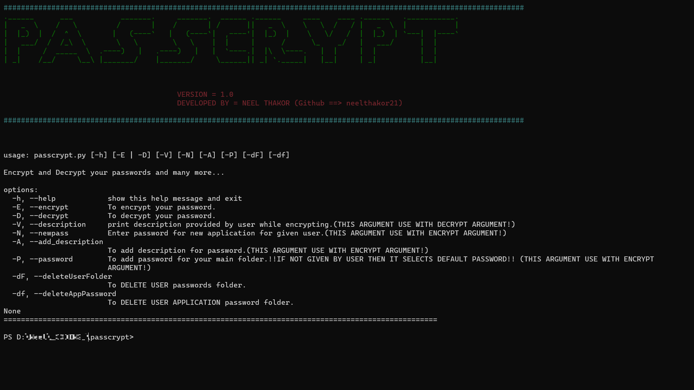
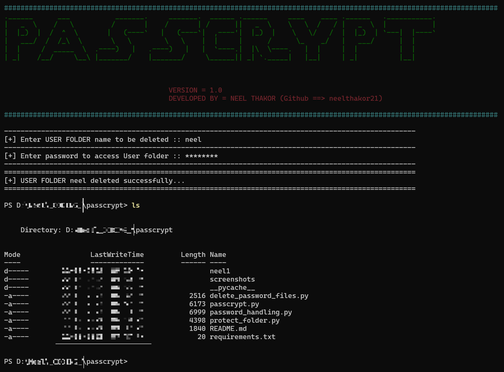

# PASSCRYPT

> passcrypt is platform where you can protect your passsword and store it safely with highly advanced encryption method

## Purpose

Using passcrypt user will be able to store and manage passwords in user folder protected with password given by user.

User can store and manage multiple types of passwords for different applications like facebook, Instagram, etc.

passcrypt stores your user folder password using **hashing** technique to provide more security to your passwords. 

## Installation

You need to have Python version 3.4+

For Download passcrypt tool.

```bash
git clone https://github.com/neelthakor21/passcrypt
```
```bash
cd passcrypt
pip install -r requirements.txt
cd passcrypt
python passcrypt.py
```
## Syntax
#### To encrypt password and store it
```bash
passcrypt.py [-E] [-A] [-P]
```
> -E  ==> used for encrypt password
>
> -A  ==> used for add description for password
>
> -P  ==> used for add password for user folder NOTE ==>IF NOT GIVEN BY USER DEFAULT PASSWORD ASSIGN TO USER FOLDER WHICH IS "**user_folder_name@passcrypt**"<==

```bash
passcrypt.py [-E] [-N]
```
> -N  ==> used for add new application password in existing user folder

#### To decrypt stored password

```bash
passcrypt.py [-D] [-V]
```

> -D  ==> used for decrypt password
>
> -V  ==> used for show description entered by user while encrypting

#### To delete existing folder/files

```bash
passcrypt.py [-dF] 
```
OR
```bash
passcrypt.py [-df]
```

> -dF  ==> used for delete user folder
>
> -df  ==> used for delete user application folder from user folder

## Output

#### password encryption




#### password decryption


#### User password folder/file delete




---

**Please report functionality issues and bugs if found.**

> ## License
> [GNU Affero General Public License v3.0](https://www.gnu.org/licenses/agpl-3.0.en.html)
